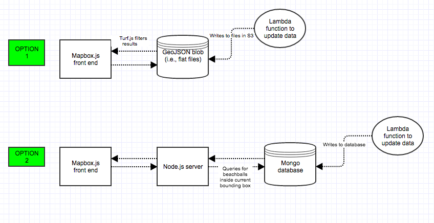

#Global CMT Viewer

###Two architecture options:

###Two deployment options:
1. Elastic Beanstalk environment in Richard's AWS account
2. Rancher/Cattle via Liffft's account

Files for a webmap showing focal mechanism 'beachballs' for the Global CMT catalog.

###Two architecture options:

###Two deployment options:
1. Elastic Beanstalk environment in Richard's AWS account
2. Rancher/Cattle via Liffft's account

